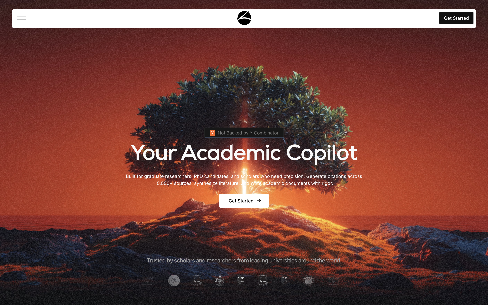
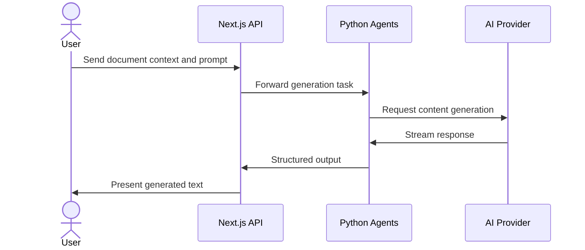
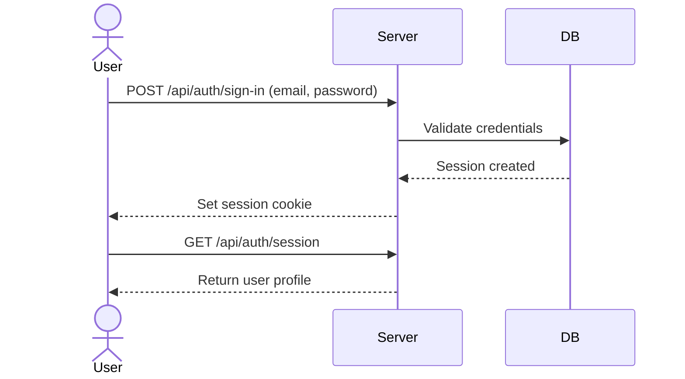

# Orunos

**Your Academic Copilot** — Create authentic academic documents with AI that understands your writing style.

Orunos helps researchers, students, and academics produce well-formatted papers, theses, reports, and publications using AI-powered writing assistance, automatic citations, and professional PDF export tailored to academic standards.

---



## Overview

Writing academic documents is slow and tedious. You spend hours formatting, managing citations, and polishing language. Orunos takes that burden off your shoulders. It's a platform that lets you focus on your ideas while it handles the repetitive stuff—formatting, bibliography, language refinement, and even content generation. You can work from your browser or on your phone, and everything stays in sync. Whether you're a student pulling an all-nighter on a coursework or a researcher preparing a journal submission, Orunos is the copilot you wish you had.

## System Architecture


A Next.js API server acts as the backbone, handling authentication, document management, and user requests. For complex AI tasks, it offloads work to a Python agents service that coordinates with external models like DeepSeek and Groq. All structured data lives in a LibSQL database, and the frontend is available as a progressive web app or a native mobile experience via Expo.

## Features

### AI-Powered Writing and Formatting

Communicate with the AI to generate sections, rewrite paragraphs, or get suggestions. The assistant understands academic tone and can even mimic your stylometry after analyzing your previous documents.



### Professional Document Editor

A rich text editor built on Plate.js handles tables, equations, citations, and footnotes. It supports APA, MLA, Chicago, and other style guides, and includes an automatic table of contents and abstract generator. Everything is designed for dense academic content, not casual note-taking.

### Citation Management

Orunos can automatically pull citations from over 10,000 academic sources. As you write, it builds your bibliography in the background, updates inline references, and ensures your citations follow the required style guide. You can also import existing BibTeX or RIS files.

### Mobile Companion App

The Expo-based mobile app gives you access to your documents on the go. View, edit, and sync with the web version. It supports dark mode, native gestures, and secure authentication.

### Secure Authentication and Billing

Email/password and Google OAuth authentication are handled by Better Auth. Sessions persist securely across devices. A built-in billing system lets you top up credits for premium AI usage.



## Technologies Used

| Category | Technology |
|----------|------------|
| **Frontend (Web)** | Next.js, React, Tailwind CSS, Plate.js, Zustand |
| **Frontend (Mobile)** | Expo, React Native, Uniwind, HeroUI Native |
| **Backend** | Next.js API routes, Python FastAPI, LangChain |
| **Database** | LibSQL (Turso), Prisma ORM |
| **AI/ML** | DeepSeek, Groq, OpenAI, AI SDK |
| **Auth** | Better Auth |
| **Payments** | (integrated billing system) |
| **File Upload** | UploadThing |
| **Monorepo** | Turborepo, Bun workspaces |
| **Monitoring** | Sentry |

## API Documentation

### Authentication

All endpoints under `/api/auth/*` are managed by Better Auth. You can use the standard client SDK or direct HTTP calls.

#### `GET /api/auth/session`
Retrieve the current user session.

**Response**:
```json
{
  "user": {
    "id": "user_123",
    "email": "user@example.com",
    "name": "John Doe"
  },
  "session": {
    "id": "sess_456",
    "expires": "2026-03-01T00:00:00Z"
  }
}
```

### Documents

#### `GET /api/papers/all`
Fetch all documents belonging to the authenticated user.

**Response**:
```json
{
  "documents": [
    {
      "id": "doc_1",
      "title": "My Research Paper",
      "docTypeId": "research",
      "status": "DRAFT",
      "createdAt": "2026-01-15T10:30:00Z"
    }
  ]
}
```

#### `GET /api/papers/fetch`
Fetch a single document by ID.

**Request** (query):
`?id=doc_1`

**Response**:
```json
{
  "document": {
    "id": "doc_1",
    "title": "My Research Paper",
    "content": "...",
    "docTypeId": "research",
    "status": "DRAFT"
  }
}
```

**Errors**:
- `404` Document not found.

#### `POST /api/papers/update`
Update document content or metadata.

**Request**:
```json
{
  "id": "doc_1",
  "title": "Updated Title",
  "content": "New content..."
}
```

**Response**:
```json
{
  "success": true,
  "document": { ... }
}
```

#### `DELETE /api/papers/delete`
Permanently delete a document. Requires `id` in body.

**Request**:
```json
{
  "id": "doc_1"
}
```

**Response**:
```json
{
  "success": true
}
```

### AI Generation

#### `POST /api/ai/generate`
Generate academic content using AI. The request includes the document context and user prompt.

**Request**:
```json
{
  "docId": "doc_1",
  "prompt": "Write an introduction about climate change",
  "style": "apa"
}
```

**Response** (streamed/JSON):
```json
{
  "generatedText": "According to the Intergovernmental Panel on Climate Change..."
}
```

#### `POST /api/ai/command`
Execute a specific AI command (e.g., "rewrite", "expand", "summarize").

**Request**:
```json
{
  "docId": "doc_1",
  "command": "rewrite",
  "selection": "The current section..."
}
```

#### `POST /api/ai/copilot`
Activate the AI copilot for real-time suggestions.

### File Uploads

#### `POST /api/uploadthing`
Upload files (images, attachments) to use in documents. Returns a URL.

### Python Agents Service

#### `POST /api/v1/fast`
Initiate a document generation task (long-running).

**Request**:
```json
{
  "docID": "doc_1",
  "docType": "research",
  "question": "What is the impact of AI on education?"
}
```

**Response** (initial):
```json
{
  "status": "started",
  "docID": "doc_1"
}
```

#### `POST /api/v1/email`
Generate cold outreach emails for leads.

**Request**:
```json
{
  "companies": [
    {
      "name": "Acme Corp",
      "profile": "A fast-growing tech company..."
    }
  ]
}
```

**Response**:
```json
{
  "emails": ["Dear Acme Corp..."]
}
```

**Authentication**: All API endpoints (except `/api/auth/*` public ones) require a valid session cookie or API key (`x-api-key` header for the Python service).

## Environment Variables

Create a `.env.local` file in `apps/web`:

```
DATABASE_URL="file:./dev.db"
PROD="false"
BETTER_AUTH_SECRET="your-secret"
GOOGLE_CLIENT_ID="..."
GOOGLE_CLIENT_SECRET="..."
RESEND_API_KEY="..."
UPLOADTHING_TOKEN="..."
DEEPSEEK_API_KEY="..."
GROQ_API_KEY="..."
OPENAI_API_KEY="..."
SENTRY_ORG="..."
SENTRY_PROJECT="orunos"
```

For the mobile app (`apps/mobile/.env`):
```
API_URL="http://localhost:3000"
```

For the Python agents service (`apps/agents/.env`):
```
SECRET_KEY="shared-api-key"
DEEPSEEK_API_KEY="..."
EXA_API_KEY="..."
```

## Installation

1. **Clone the repo**
   ```bash
   git clone https://github.com/kimbrenekakande/orunos.git
   cd orunos
   ```

2. **Install dependencies** (Bun required)
   ```bash
   bun install
   ```

3. **Set up environment variables** as shown above.

4. **Initialize the database**
   ```bash
   cd apps/web
   bun prisma generate
   bun prisma db push
   ```

5. **Run the development servers**
   ```bash
   # From the root
   bun dev
   ```
   The web app will be at `http://localhost:3000`. The mobile dev server runs concurrently (Expo) and can be opened on a simulator or via QR code.

## Usage

- **Web**: Open your browser to the local address, sign up with email or Google, and start a new document from the dashboard.
- **Mobile**: After starting the dev server, press `a` for Android emulator or `i` for iOS simulator (or scan the QR code with Expo Go). The mobile app connects to the same backend.

For a complete walkthrough, see the [web app README](./apps/web/README.md) and [mobile README](./apps/mobile/README.md).

---

[](https://www.typescriptlang.org/)
[](https://nextjs.org/)
[](https://reactjs.org/)
[](https://expo.dev/)
[](https://www.python.org/)
[](https://fastapi.tiangolo.com/)
[](https://tailwindcss.com/)
[](https://www.prisma.io/)
[](https://bun.sh/)
[](https://turbo.build/)

[](https://dokugen.samueltuoyo.com)